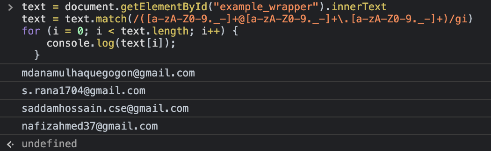

# AM Automate Tools

## Extract Email From Text File

Extract email list from any text file. There are few options including sorting and output as any file format.

**File name:**

[extract_email_from_text.py](extract_email_from_text.py)

*Run the command with any file, for example file name is list_of_email.txt, and output file will be extract_email.txt*

`python extract_email_from_text.py list_of_email.txt > extract_email.text`

*To sort and unique email Run the command with any file, for example file name is list_of_email.txt, and output file will be extract_email.txt*

`python extract_email_from_text.py list_of_email.txt | sort | uniq > extract_email.text`

## Extract Mobile Number From Text File

Extract mobile numbers (Bangladeshi Mobile number formated as 01XXXXXXXXX) list from any text file. 

**File name:**

[extract_phone.py](extract_phone.py)

There are two files, one is input.txt which contain the raw data, we will extract phone number from this file as output.txt. End of the process we will print the total number. Run the following command

`python extract_phone.py`

## Extract Email From Website

Extract email from website

**File name:**

[scrape_email_js.txt](scrape_email_js.txt)

In the browser console run the code, in console it will output the extracted email.

